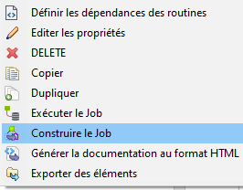

# Talend Job Manager

A tool for manage Talend job (zip format) for your application.

[](https://openjdk.org/)
[](https://www.talend.com/fr/products/talend-open-studio/)

## Build your job

On first, you need to build your job with Talend, tested with Talend Open Studio. 

Just right click on your job and select in menu:



File output example:

```bash
myjobname_0.1.zip
```
## Development:

You can use directly executor class in your code, for example:


- For add or update job in repository

```java
import inzh.talend.job.manager.executor.SimpleJobExecutor;

Path path = Paths.get("myjobname_0.1.zip"); // Your job zip file  
Path repositoryPath = Paths.get("jobs"); // Your repository path

SimpleJobExecutor.put(path, repositoryPath);
```

- To run the latest version of job :

```java
import inzh.talend.job.manager.executor.SimpleJobExecutor;

String jobName = "myjobname"; // Your job name
Path repositoryPath = Paths.get("jobs"); // Your repository path

Map parameters = new HashMap(){{
    put("contextparam1", "value1");
    put("contextparam2", "value2");
}}; // Context parameters passed to job

SimpleJobExecutor.execute(jobName, parameters, repositoryPath);
```

- To run the specific version of job :

```java
import inzh.talend.job.manager.executor.SimpleJobExecutor;

String jobName = "myjobname"; // Your job name
Path repositoryPath = Paths.get("jobs"); // Your repository path
Double version = 0.1;

Map parameters = new HashMap(){{
    put("contextparam1", "value1");
    put("contextparam2", "value2");
}}; // Context parameters passed to job

SimpleJobExecutor.execute(jobName, parameters, repositoryPath, version);
```
#

[© 2011-2023 [InZH] Studio.](https://www.inzh.fr/)